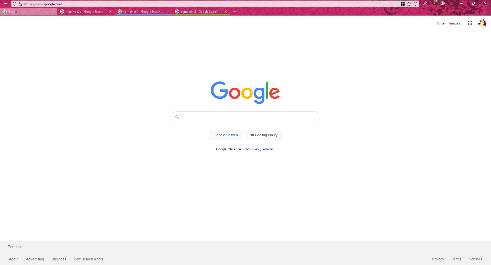
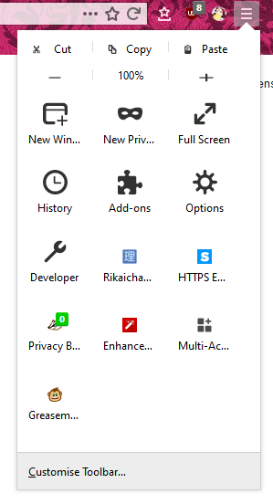

# Firefox-Custom-CSS
My current firefox setup.

## Sources:

* https://github.com/Aris-t2/CustomCSSforFx
* https://github.com/MrOtherGuy/firefox-csshacks
* https://www.reddit.com/r/FirefoxCSS/

The code blocks were mainly copied from the above sources, with a few changes made by me.

## Screenshots

### Theme

* https://addons.mozilla.org/en-US/firefox/addon/pink-flourishes/